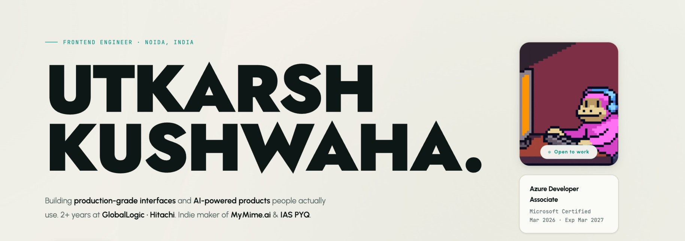

<div align="center">

<!-- Replace the src below with your actual image URL after uploading to your repo -->


<br/><br/>

<a href="https://git.io/typing-svg">
  
</a>

<br/><br/>

[](https://www.linkedin.com/in/utkarsh-kushwaha-2023/)
[](https://github.com/UtkarshKushwaha1)
[](https://github.com/UtkarshKushwaha1)

</div>

---

## 👋 About Me

Frontend Developer building **high-performance Angular applications** and **AI-powered web products**.
Focused on creating scalable, fast, and user-centric interfaces for real-world problems.

---

```typescript
const utkarsh: Developer = {
  name:       "Utkarsh Kushwaha",
  stack:      ["Angular", "TypeScript", "JavaScript", "HTML5", "CSS3"],
  focus:      ["Performance optimization", "Scalable architecture", "AI-powered UIs"],
  superpower: "Turning designs into fast, production-ready UIs",
};

// currently learning → Angular performance, Web Vitals, advanced RxJS
// open to → collabs, open-source, real-world product building
```

---

## 🚀 Featured Projects

| Project | Description | Link |
|--------|-------------|------|
| 🤖 **BroFind AI** | AI-powered platform to discover useful AI tools | [brofindai.com](https://brofindai.com/) |
| 📰 **MyMime** | Personalized news with LLM filtering & interest ranking | [mymime.ai](https://mymime.ai/) |
| 📚 **IAS PYQ** | Free UPSC prep platform — thousands of questions | [iaspyq.com](https://iaspyq.com/) |

---

## ⚡ Tech Stack

<div align="center">


</div>

---

## 📊 GitHub Stats

<div align="center">


&nbsp;


<br/><br/>


</div>

---

## 📈 Activity Graph


---

## 🐍 Contribution Snake

<picture>
  <source media="(prefers-color-scheme: dark)" srcset="https://raw.githubusercontent.com/platane/snk/output/github-contribution-grid-snake-dark.svg">
  <source media="(prefers-color-scheme: light)" srcset="https://raw.githubusercontent.com/platane/snk/output/github-contribution-grid-snake.svg">
  
</picture>

---

<div align="center">

### Let's build something great 🚀

[](https://www.linkedin.com/in/utkarsh-kushwaha-2023/)

<br/>

*crafted with ♥ & too much coffee*


</div>
